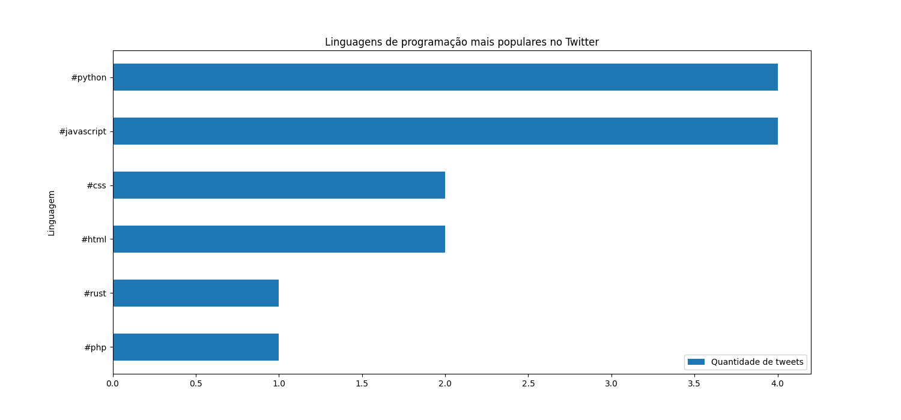

# Hashtag Counter
Simples projeto para recuperar e processar tweets que contenham determinadas hashtags e analisar a popularidade de determinados assuntos, neste caso, linguagens de programação. Para seu desenvolvimento, foram utilizados Node.js para a coleta de dados e Python para o seu processamento.

## Exemplo de resultado


## Dependências
### Tweet Stream
- Node.js
- Docker & docker-compose
### Hashtag Counter
- Python
- PySpark

## Configuração
Clone o projeto e acesse o diretório:
```
git clone git@github.com:nakahwra/hashtag-counter.git
cd hastag_counter
```
### Tweet Stream
Acesse o diretório:
```
cd store-tweet-stream
```
Instale as dependências:
```bash
yarn install 
# ou
npm install
```
Com o docker configurado, suba o container:
```
docker-compose -d
```

### Hashtag Counter
Instale as dependências:
```
pip install pymongo pyspark pandas matplotlib
```
Baixe o driver do MongoDB para o Spark:
```
curl https://download.jar-download.com/cache_jars/org.mongodb.spark/mongo-spark-connector_2.12/3.0.1/jar_files.zip > mongo-spark-jars.zip
```
Extraia o arquivo no diretório `jars` de seu PySpark:
```
unzip mongo-spark-jars.zip -d <pyspark home>/jars
```
## Execução do projeto
### Tweet Stream
Execute o projeto com:
```
yarn run dev
```
Deixe-o rodando pelo tempo desejado. Tweets que contenham as hashtags definidas no código serão recuperados e armazenados na coleção `tweets` do banco `hashtag_counter` no MongoDB.

### Hashtag Counter
Execute o projeto com:
```
python3 main.py
```
Os tweets armazenados no banco serão processados e usados para gerar o gráfico das dez linguagens mais populares com base na frequência de uso de suas hashtags. O resultado pode ser visualizado pela imagem gerada na pasta raíz do projeto `barh-languages.png` ou através de uma tabela no retorno do script pelo terminal.

---
🚀 Desenvolvido por **Lucas Nakahara**, **Gabriel Rodrigues** e **Enrico Secco**
